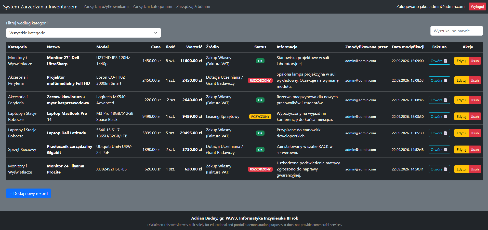
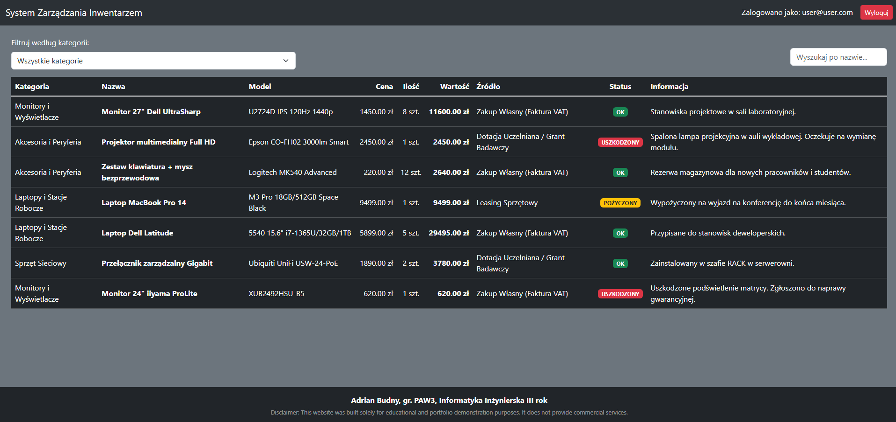
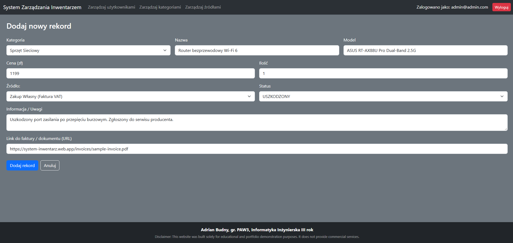
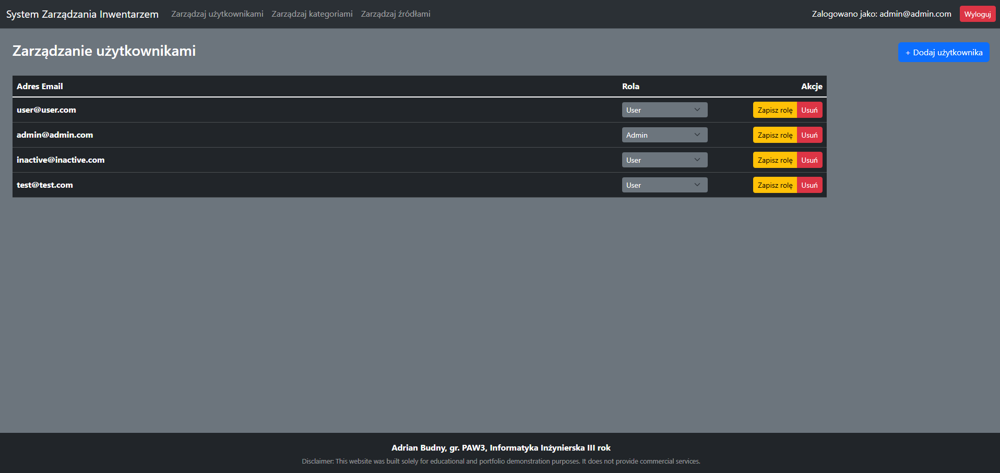
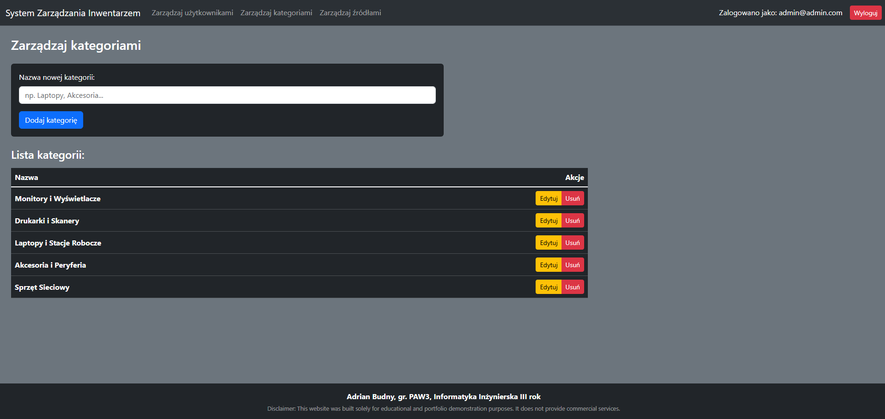
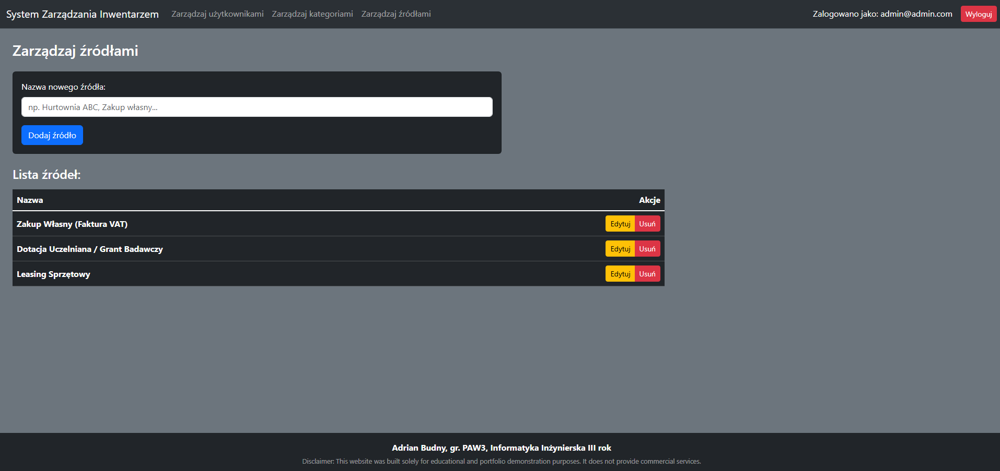

# System Zarządzania Inwentarzem (Shop Inventory Manager)

Aplikacja webowa typu SPA (Single Page Application) stworzona przy użyciu frameworka **Vue.js 3** oraz platformy **Google Firebase**. System umożliwia ewidencjonowanie sprzętu, zarządzanie stanem magazynowym, kategoryzację, podpinanie dokumentacji zewnętrznej (faktur/gwarancji) oraz precyzyjną kontrolę dostępu z podziałem na role użytkowników.

> [!IMPORTANT]
> ### Wersja demonstracyjna na żywo (Live Demo)
> Przetestuj działającą aplikację: **[system-inwentarz.web.app](https://system-inwentarz.web.app/)**
>
> **Konta testowe:**
> * **Administrator:** email: `admin@admin.com` | hasło: `admin123`
> * **Użytkownik:** email: `user@user.com` | hasło: `user123`

---

## O projekcie

Projekt został wykonany w ramach zajęć „Projektowanie webowych aplikacji graficznych” na semestrze letnim 2023/2024, studiów pierwszego stopnia.

Aplikacja została zaprojektowana z myślą o prostym i przejrzystym zarządzaniu zasobami technicznymi i asortymentem. Rozwiązuje problem rozproszonych danych o sprzęcie poprzez centralizację informacji o modelach, cenach, źródłach pochodzenia, statusie sprawności oraz odnośnikach do dokumentacji (np. skanów faktur na zewnętrznych dyskach).

Autoryzacja oparta o Firebase Auth oraz mechanizm strażników tras (`vue-router navigation guards`) gwarantują, że kluczowe moduły edycyjne i zarządzanie kontami są dostępne wyłącznie dla uprawnionych administratorów.

---

## Kluczowe funkcjonalności

* **Zarządzanie asortymentem (CRUD):** Dodawanie, edycja i usuwanie pozycji magazynowych (nazwa, model, kategoria, cena, ilość, stan techniczny, uwagi).
* **Klasyfikacja zasobów:** Samodzielne definiowanie kategorii sprzętu oraz źródeł zaopatrzenia.
* **Odnośniki do dokumentacji:** Możliwość podpięcia bezpośredniego linku URL do faktury lub karty gwarancyjnej przy każdym przedmiocie.
* **Kontrola dostępu (RBAC):**
  * **Użytkownik (User):** Przeglądanie i filtrowanie stanu inwentarza.
  * **Administrator (Admin):** Pełny dostęp do edycji bazy, zarządzania kategoriami, źródłami i kontami użytkowników.
* **Filtrowanie i wyszukiwarka:** Dynamiczne przeszukiwanie asortymentu po nazwie oraz filtrowanie według kategorii.
* **Śledzenie historii zmian:** Automatyczny zapis adresu email użytkownika wprowadzającego modyfikacje oraz znacznik czasu (`serverTimestamp`).
* **Modułowa architektura:** Reużywalne komponenty nawigacji i stopki (`AppNavbar`, `AppFooter`) dla spójnego interfejsu.

---

## Zrzuty ekranu

<p align="center">
  
  <br>
  <em>Rysunek 1: Główny panel inwentarza w widoku Administratora z pełnymi operacjami CRUD i historią zmian.</em>
</p>

<br>

<p align="center">
  
  <br>
  <em>Rysunek 2: Główny panel inwentarza w widoku Użytkownika z ograniczonymi uprawnieniami i filtrowaniem.</em>
</p>

<br>

<p align="center">
  
  <br>
  <em>Rysunek 3: Formularz dodawania nowego przedmiotu z wyborem kategorii, źródła oraz linku do faktury.</em>
</p>

<br>

<p align="center">
  
  <br>
  <em>Rysunek 4: Panel zarządzania kontami użytkowników oraz weryfikacji przypisanych ról.</em>
</p>

<br>

<p align="center">
  
  <br>
  <em>Rysunek 5: Panel definiowania i zarządzania kategoriami asortymentu.</em>
</p>

<br>

<p align="center">
  
  <br>
  <em>Rysunek 6: Panel definiowania i zarządzania źródłami pochodzenia sprzętu.</em>
</p>

---

## Technologie i narzędzia

* **Frontend:** [Vue.js 3](https://vuejs.org/) (Options API), JavaScript (ES6+), HTML5, CSS3
* **Routing:** [Vue Router 4](https://router.vuejs.org/) (tryb HTML5 History, ochrona tras poprzez `Navigation Guards`)
* **UI & Stylowanie:** [Bootstrap 5](https://getbootstrap.com/) (ciemny motyw, responsywny grid system)
* **Backend & Autoryzacja:** [Firebase Authentication](https://firebase.google.com/docs/auth) (uwierzytelnianie e-mail/hasło, sesje tokenowe)
* **Baza danych:** [Cloud Firestore](https://firebase.google.com/docs/firestore) (nierelacyjna baza dokumentowa NoSQL)
* **Hosting produkcyjny:** [Firebase Hosting](https://firebase.google.com/docs/hosting) (globalna sieć CDN, obsługa routingu SPA)
* **Narzędzia developerskie:** Vue CLI, Babel, Node.js, npm, Firebase CLI

---

## Instrukcja instalacji i uruchomienia

### Wymagania

- Zainstalowane środowisko [Node.js](https://nodejs.org/) (wersja 16.x lub nowsza)
- Menedżer pakietów **npm** (dołączony do Node.js).
- Utworzony projekt w [Google Firebase Console](https://console.firebase.google.com/) z włączonymi usługami **Firestore Database** oraz **Authentication** (Email/Password).

### Instrukcja

1. **Sklonuj repozytorium:**
   ```bash
   git clone https://github.com/AdiKungen/Projekt_PWAG_Budny_Adrian_PAW3.git
   cd Projekt_PWAG_Budny_Adrian_PAW3
   ```

2. **Zainstaluj zależności:**
   ```bash
   npm install
   ```

3. **Skonfiguruj zmienne środowiskowe:**   
   Stwórz w głównym katalogu projektu plik `.env.local` na wzór `.env.example` i uzupełnij go danymi swojego projektu Firebase:
   ```env
   VUE_APP_FIREBASE_API_KEY=twoj_klucz_api
   VUE_APP_FIREBASE_AUTH_DOMAIN=twoj-projekt.firebaseapp.com
   VUE_APP_FIREBASE_PROJECT_ID=twoj-projekt
   VUE_APP_FIREBASE_STORAGE_BUCKET=twoj-projekt.appspot.com
   VUE_APP_FIREBASE_MESSAGING_SENDER_ID=twoj_sender_id
   VUE_APP_FIREBASE_APP_ID=twoj_app_id
   ```

4. **Uruchom lokalny serwer deweloperski:**
   ```bash
   npm run serve
   ```
   Otwórz w przeglądarce adres wskazany w konsoli (domyślnie `http://localhost:8080/`).

---

## Podziękowania / Credits

* **Ikona aplikacji (`inventory`):** pochodzi z biblioteki [Material Symbols & Icons](https://fonts.google.com/icons?selected=Material+Symbols+Outlined:inventory:FILL@0;wght@400;GRAD@0;opsz@48&icon.query=inventor&icon.size=225&icon.color=%2375FB4C) od Google, udostępnionej na licencji [Apache License 2.0](https://www.apache.org/licenses/LICENSE-2.0).

---

## Zastrzeżenie / Disclaimer

**PL:**  
Serwis został stworzony wyłącznie w celach edukacyjnych i prezentacji portfolio. Nie prowadzi działalności komercyjnej.

**EN:**  
This website was built solely for educational and portfolio demonstration purposes. It does not provide commercial services.

---

## Licencja / License

**PL:**  
Copyright (c) 2026 Adrian Budny. Wszelkie prawa zastrzeżone.  
Kod źródłowy tego projektu udostępniony jest wyłącznie do wglądu w celach demonstracji portfolio i weryfikacji umiejętności. Kopiowanie, modyfikowanie, rozpowszechnianie lub wykorzystywanie tego kodu w celach komercyjnych lub prywatnych bez pisemnej zgody autora jest zabronione.

**EN:**  
Copyright (c) 2026 Adrian Budny. All rights reserved.  
This source code is made publicly available solely for portfolio demonstration and technical evaluation. No permission is granted to copy, modify, distribute, or use this code for any commercial or non-commercial purpose without prior written consent from the author.
